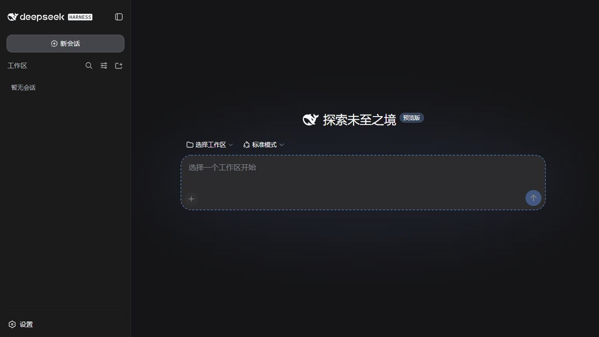

<p align="center">
  
</p>

<h1 align="center">DSH-Portable</h1>

<p align="center">
  Carry DeepSeek Harness, sessions, settings, plugins, and workspace together.<br>
  Copy one folder to another drive, USB device, or PC and continue working.
</p>

<p align="center">
  <a href="README.md">简体中文</a> · <strong>English</strong>
</p>

<p align="center">
  <a href="https://github.com/WSL043/DSH-Portable/releases/latest"></a>
  
  <a href="LICENSE"></a>
</p>

<p align="center">
  <a href="https://github.com/WSL043/DSH-Portable/releases/latest/download/DSH-Portable-windows-x64.exe"><strong>Download Windows portable (recommended)</strong></a>
  &nbsp;·&nbsp;
  <a href="#other-downloads">Other platforms and install modes</a>
</p>

<p align="center">
  
</p>

> [!NOTE]
> DeepSeek Harness is currently a developer preview. DSH-Portable is an
> independent community distribution, not an official DeepSeek desktop app.

## Start in 3 steps

1. Download the [**Windows portable launcher**](https://github.com/WSL043/DSH-Portable/releases/latest/download/DSH-Portable-windows-x64.exe).
2. Run it once. It prepares a complete `DSH-Portable` folder beside itself and opens the desktop app.
3. Connect a model in the interface. Next time, run `DeepSeek-Herness.exe` in that folder.

Closing the window sends the app to the system tray by default, so active tasks keep running.
Use **Exit DeepSeek Harness** in the tray menu to stop everything, or change **When closing the
window** to exit directly.

## Built for portable use

- **One complete work environment**: sessions, settings, plugins, default workspace, and desktop data move together.
- **Continue from a new location**: copy the folder to another drive, USB device, or Windows PC.
- **Simple backup**: exit the app, then copy one folder instead of finding separate data directories.
- **Native desktop ownership**: a dedicated window, taskbar identity, and system tray replace browser app-mode windows.
- **Data-safe updates**: tested releases preserve local sessions, credentials, plugins, and workspace.
- **Online or offline preparation**: use the small launcher normally or the complete ZIP on a restricted network.

## Moving, backing up, and syncing

1. Choose **Exit DeepSeek Harness** from the system tray and wait for its icon to disappear.
2. Copy the entire `DSH-Portable` folder.
3. Run `DeepSeek-Herness.exe` from the new location.

Managed paths are repaired automatically after a move. External projects keep their original paths.
When syncing between two computers, exit the app on both before syncing the whole folder.

## Other downloads

### Windows

| Use case | Download |
| --- | --- |
| **Portable use (recommended)** | [Portable launcher](https://github.com/WSL043/DSH-Portable/releases/latest/download/DSH-Portable-windows-x64.exe) — creates a movable folder on first run |
| **First setup must work offline** | [Complete portable ZIP](https://github.com/WSL043/DSH-Portable/releases/latest/download/DSH-Portable-windows-x64-offline.zip) |
| **Install like a normal app** | [Windows installer](https://github.com/WSL043/DSH-Portable/releases/latest/download/DeepSeek-Herness-Setup.exe) — Start menu, shortcut, and standard uninstall |

### macOS

| Mac | Portable ZIP | Disk image |
| --- | --- | --- |
| Apple Silicon (M1–M4) | [ZIP](https://github.com/WSL043/DSH-Portable/releases/latest/download/DSH-Portable-macos-arm64.zip) | [DMG](https://github.com/WSL043/DSH-Portable/releases/latest/download/DeepSeek-Herness-macos-arm64.dmg) |
| Intel | [ZIP](https://github.com/WSL043/DSH-Portable/releases/latest/download/DSH-Portable-macos-x64.zip) | [DMG](https://github.com/WSL043/DSH-Portable/releases/latest/download/DeepSeek-Herness-macos-x64.dmg) |

The macOS packages are ad-hoc signed, not notarized by Apple. If first launch is blocked,
Control-click the app and choose **Open**.

## Plugin management

The Windows product includes its plugin command. Open PowerShell in the DSH-Portable folder:

```powershell
.\dsh.exe plugin --profile web add <plugin>
.\dsh.exe plugin --profile web list --depth 0
.\dsh.exe plugin --profile web update <package-name>
.\dsh.exe plugin --profile web remove <package-name>
.\dsh.exe --profile web --dump-config
```

Plugins and settings travel with the portable data. Plugin changes never restart a running task;
save your work and restart the app when convenient. Install only plugins you trust.

To use ChatGPT / Codex subscription models, follow the optional plugin repository:
[**WSL043/dsh-codex-subscription**](https://github.com/WSL043/dsh-codex-subscription).
It is not bundled with DSH-Portable and can be installed or removed independently.

## Updates

DSH-Portable checks for updates when it starts and asks before installing one. A normal update
downloads only the changed DSH application component. Sessions, settings, credentials, and workspace remain in place. Files are verified before replacement, and a failed launch restores
the previous version.

When the runtime compatibility boundary changes, DSH-Portable requests a complete package. Official
preview updates first become candidate builds and must pass Windows and macOS finished-product
tests before they enter the launcher update channel.

## Portable data

- `data/dsh-home/`: settings, credentials, sessions, and plugins;
- `data/webview2/`: Windows desktop web data;
- `workspace/`: default workspace;
- `data/logs/`: local service logs.

The installed edition keeps the same data under `%LOCALAPPDATA%\DeepSeek-Herness` and does not
delete it during uninstall.

## Security

DSH is an agent environment with local code-execution capability. Use trusted models, plugins,
and projects. The service binds only to `127.0.0.1`, and this shell disables DSH telemetry by default.

The `data` directory can contain API credentials and private conversations. Protect it accordingly.
Use NTFS for removable Windows drives when possible; FAT and exFAT do not provide equivalent permissions.

<details>
<summary><strong>Build from source</strong></summary>

```powershell
./scripts/build-windows.ps1
```

```bash
bash scripts/build-macos.sh arm64   # or x64
```

The repository pins dependencies, release contents, and finished-product tests. The launcher handles
download verification, so normal users do not need to compare checksums manually.

</details>

DeepSeek Harness, the DeepSeek name, and its marks belong to DeepSeek. DSH-Portable is maintained
independently by WSL043 and is not endorsed by DeepSeek.
