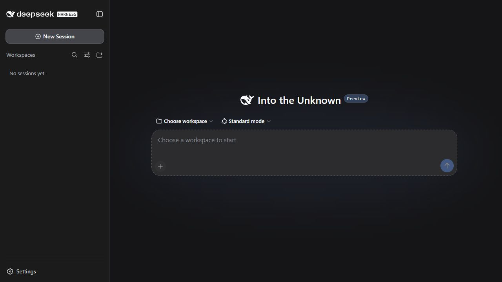

<p align="center">
  
</p>

<h1 align="center">DSH-Portable</h1>

<p align="center">
  Carry DeepSeek Harness, sessions, settings, plugins, and workspace together.<br>
  Copy one folder to another drive, USB device, or PC and continue working.
</p>

<p align="center">
  <a href="README.md">简体中文</a> · <strong>English</strong>
</p>

<p align="center">
  <a href="https://github.com/WSL043/DSH-Portable/releases/latest"></a>
  
  <a href="https://github.com/WSL043/DSH-Portable"></a>
  <a href="LICENSE"></a>
</p>

<p align="center">
  <a href="https://github.com/WSL043/DSH-Portable/releases/latest/download/DSH-Portable-windows-x64.exe"><strong>Download Windows portable (recommended)</strong></a>
  &nbsp;·&nbsp;
  <a href="#other-downloads">Other platforms and install modes</a>
</p>

<p align="center">
  
</p>

> [!NOTE]
> DeepSeek Harness is currently a developer preview. DSH-Portable is an
> independent community distribution, not an official DeepSeek desktop app.

## Start in 3 steps

1. Download the [**Windows portable launcher**](https://github.com/WSL043/DSH-Portable/releases/latest/download/DSH-Portable-windows-x64.exe).
2. Run it once. It prepares a complete `DSH-Portable` folder beside itself and opens the desktop app.
3. Connect a model in the interface. Next time, run `DeepSeek-Herness.exe` in that folder.

Closing the window sends the app to the system tray by default, so active tasks keep running.
Use **Exit DeepSeek Harness** in the tray menu to stop everything, or change **When closing the
window** to exit directly. The tray follows the DSH language and light/dark appearance, and can
open a recent session or start a new one directly.

The Windows launcher and installer follow the system UI language in Chinese or English. The DSH
workspace language can also be changed in **Settings**, and that choice is remembered.

## Built for portable use

- **One complete work environment**: sessions, settings, plugins, default workspace, and desktop data move together.
- **Continue from a new location**: copy the folder to another drive, USB device, or Windows PC.
- **Simple backup**: exit the app, then copy one folder instead of finding separate data directories.
- **Native desktop ownership**: a dedicated window, taskbar identity, system tray, and remembered window placement.
- **Data-safe updates**: tested releases preserve local sessions, credentials, plugins, and workspace.
- **Online or offline preparation**: use the small launcher normally or the complete ZIP on a restricted network.

## Moving, backing up, and syncing

1. Choose **Exit DeepSeek Harness** from the system tray and wait for its icon to disappear.
2. Copy the entire `DSH-Portable` folder.
3. Run `DeepSeek-Herness.exe` from the new location.

Managed paths are repaired automatically after a move. External projects keep their original paths.
When syncing between two computers, exit the app on both before syncing the whole folder.

## Other downloads

### Windows

| Use case | Download |
| --- | --- |
| **Portable use (recommended)** | [Portable launcher](https://github.com/WSL043/DSH-Portable/releases/latest/download/DSH-Portable-windows-x64.exe) — creates a movable folder on first run |
| **First setup must work offline** | [Complete portable ZIP](https://github.com/WSL043/DSH-Portable/releases/latest/download/DSH-Portable-windows-x64-offline.zip) |
| **Install like a normal app** | [Windows installer](https://github.com/WSL043/DSH-Portable/releases/latest/download/DeepSeek-Herness-Setup.exe) — Start menu, shortcut, and standard uninstall |

### macOS

| Mac | Portable ZIP | Disk image |
| --- | --- | --- |
| Apple Silicon (M1–M4) | [ZIP](https://github.com/WSL043/DSH-Portable/releases/latest/download/DSH-Portable-macos-arm64.zip) | [DMG](https://github.com/WSL043/DSH-Portable/releases/latest/download/DeepSeek-Herness-macos-arm64.dmg) |
| Intel | [ZIP](https://github.com/WSL043/DSH-Portable/releases/latest/download/DSH-Portable-macos-x64.zip) | [DMG](https://github.com/WSL043/DSH-Portable/releases/latest/download/DeepSeek-Herness-macos-x64.dmg) |

The macOS packages are ad-hoc signed, not notarized by Apple. If first launch is blocked,
Control-click the app and choose **Open**.

### Linux

| Computer | One-click app (recommended) | Complete portable folder |
| --- | --- | --- |
| Common Intel / AMD computer (x64) | [AppImage](https://github.com/WSL043/DSH-Portable/releases/latest/download/DeepSeek-Herness-linux-x64.AppImage) | [tar.gz](https://github.com/WSL043/DSH-Portable/releases/latest/download/DSH-Portable-linux-x64.tar.gz) |
| ARM64 computer | [AppImage](https://github.com/WSL043/DSH-Portable/releases/latest/download/DeepSeek-Herness-linux-arm64.AppImage) | [tar.gz](https://github.com/WSL043/DSH-Portable/releases/latest/download/DSH-Portable-linux-arm64.tar.gz) |

Make the AppImage executable once, then run it:

```bash
chmod +x DeepSeek-Herness-linux-x64.AppImage
./DeepSeek-Herness-linux-x64.AppImage
```

The AppImage keeps sessions, settings, plugins, and workspace in a sibling
`DSH-Portable-data` folder. Move or back up the AppImage and that folder together. The tar.gz
contains a complete `DSH-Portable` directory; extract it and run `DeepSeek-Herness` inside.

## Plugin management

Windows and Linux products include their plugin command. On Windows, open PowerShell in the DSH-Portable folder:

```powershell
.\dsh.exe plugin --profile web add <plugin>
.\dsh.exe plugin --profile web list --depth 0
.\dsh.exe plugin --profile web update <package-name>
.\dsh.exe plugin --profile web remove <package-name>
.\dsh.exe --profile web --dump-config
```

In a complete Linux portable folder, use `./dsh`. With the AppImage, use
`./DeepSeek-Herness-linux-<architecture>.AppImage dsh`:

```bash
./dsh plugin --profile web add <plugin>
./dsh plugin --profile web list --depth 0
./dsh plugin --profile web update <package-name>
./dsh plugin --profile web remove <package-name>
./dsh --profile web --dump-config
```

Plugins and settings travel with the portable data. Plugin changes never restart a running task;
save your work and restart the app when convenient. Install only plugins you trust.

To use ChatGPT / Codex subscription models, follow the optional plugin repository:
[**WSL043/dsh-codex-subscription**](https://github.com/WSL043/dsh-codex-subscription).
It is not bundled with DSH-Portable and can be installed or removed independently.

## Updates

Versions without a suffix, such as `0.2.0`, are stable releases. Versions ending in `-rc.N`
are release candidates, are marked **Pre-release** on GitHub, and are not offered to stable users.

Every notification names the DSH-Portable product version. The update window separately shows the
current and target bundled official DSH versions and whether the engine changes in that release.
An official DSH release is adapted and tested as a finished product before it is delivered through
DSH-Portable; it never bypasses the desktop shell to replace a working environment directly.

DSH-Portable opens the local workspace first, then checks for updates in the background and asks before installing one. Network availability does not block startup. A normal update
downloads only the changed DSH application component. Sessions, settings, credentials, and workspace remain in place.
The window shows the real download percentage and transferred size, followed by the
verification, installation, and reopen stages. A failed launch restores the previous version.

On Windows and Linux, you can **Check for updates** from the system tray; on macOS, use the application menu.
Turn off **Check for updates at startup** from the same menu if you do not want automatic prompts.
The manual check remains available. When an update is available, choose to update, handle it **Later**,
or **Skip this version**. Windows installs immediately only after it can confirm that no task is running;
macOS and Linux schedule the component for installation before the next launch. Skipping affects only that release,
and a running task is never interrupted for an update.

When the runtime compatibility boundary changes, Windows downloads the verified complete package,
keeps `data` and `workspace`, and replaces the program in place. macOS and Linux clearly request a one-time complete
package download for the same boundary. Official
preview updates first become candidate builds and must pass Windows, macOS, and Linux x64/ARM64 finished-product
tests before they enter the launcher update channel.

Default JSONL sessions upgrade normally. If you explicitly enabled DSH's optional durable SQLite backend,
back it up before upgrading. DSH-Portable does not delete an old database when an upstream preview changes
its format without providing a migration.

## Portable data

- `data/dsh-home/`: settings, credentials, sessions, and plugins;
- `data/webview2/`: Windows desktop web data;
- `workspace/`: default workspace;
- `data/logs/`: local service logs.

The installed edition keeps the same data under `%LOCALAPPDATA%\DeepSeek-Herness` and does not
delete it during uninstall.

## Get help

[**Report a problem**](https://github.com/WSL043/DSH-Portable/issues/new?template=bug-report.yml)
or [**request an improvement**](https://github.com/WSL043/DSH-Portable/issues/new?template=feature-request.yml).
Do not paste API keys, login credentials, or private conversations into an issue.

## Security

DSH is an agent environment with local code-execution capability. Use trusted models, plugins,
and projects. The service binds only to `127.0.0.1`, and this shell disables DSH telemetry by default.

The `data` directory can contain API credentials and private conversations. Protect it accordingly.
Use NTFS for removable Windows drives when possible; FAT and exFAT do not provide equivalent permissions.

<details>
<summary><strong>Build from source</strong></summary>

```powershell
./scripts/build-windows.ps1
```

```bash
bash scripts/build-macos.sh arm64   # or x64
```

The repository pins dependencies, release contents, and finished-product tests. The launcher handles
download verification, so normal users do not need to compare checksums manually.

</details>

If DSH-Portable helps you, consider giving it a
[**Star**](https://github.com/WSL043/DSH-Portable). It helps more people who need a portable DSH find the project.

DeepSeek Harness, the DeepSeek name, and its marks belong to DeepSeek. DSH-Portable is maintained
independently by WSL043 and is not endorsed by DeepSeek.
