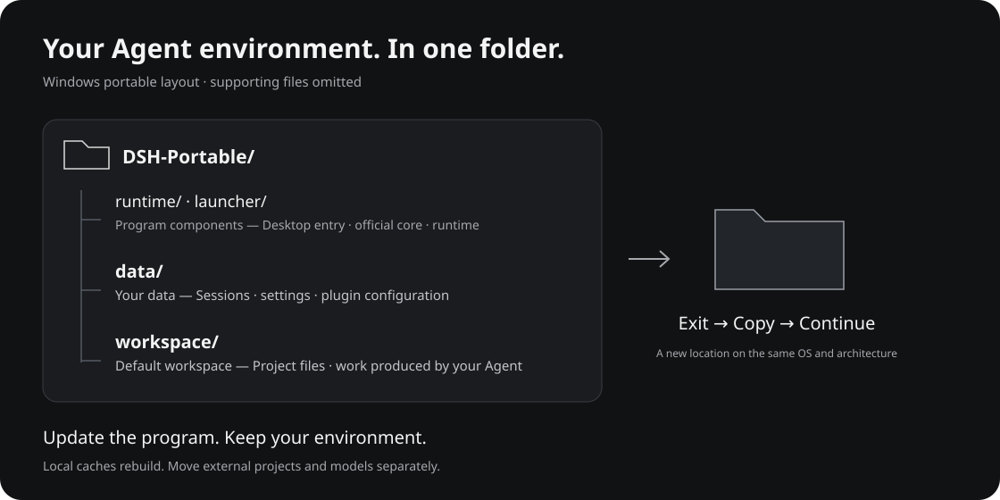

<p align="center">
  
</p>

<h1 align="center">DSH-Portable</h1>

<p align="center">
  <strong>Portable DeepSeek Harness: copy one folder to a USB drive and keep working on another computer.</strong><br>
  Sessions, settings, plugins, and workspace live in the folder. No install, no system changes; Windows, macOS, Linux.
</p>

<p align="center">
  <a href="https://wsl043.github.io/DSH-Portable/"><strong>Website</strong></a>
  · <a href="https://github.com/WSL043/DSH-Portable/releases/latest"><strong>Download</strong></a>
  · <a href="#start-in-3-steps">Get started</a>
  · <a href="docs/user-guide.en.md">User guide</a>
  · <a href="#plugins">Plugins</a>
  · <a href="#get-help">Support</a>
  · <a href="README.md">简体中文</a> · <strong>English</strong>
</p>

<p align="center">
  <a href="https://github.com/WSL043/DSH-Portable"></a>
  <a href="https://github.com/WSL043/DSH-Portable/releases/latest"></a>
  <a href="https://github.com/WSL043/DSH-Portable/releases"></a>
  <a href="https://github.com/WSL043/DSH-Portable/actions/workflows/ci.yml"></a>
  <a href="LICENSE"></a>
</p>

<p align="center">
  <a href="https://github.com/WSL043/DSH-Portable/releases/latest/download/DSH-Portable-windows-x64.exe"><strong>Download Windows portable</strong></a>
</p>

<p align="center">
  
</p>

> DSH-Portable is an independent community distribution, not an official DeepSeek application and not endorsed by DeepSeek.<br>
> DeepSeek also offers an [official desktop app](https://www.deepseek.com/harness/); each option serves different needs.

## Which should I choose?

| | Official desktop app | DSH-Portable |
| --- | --- | --- |
| Installation and platforms | Installer; Windows and macOS | Portable; Windows, macOS, and Linux, with no installation or PATH changes |
| Update cadence | Follows the official release schedule | Portable and core update separately; choose a core version |
| Moving and maintenance | Standard desktop installation | After fully exiting, copy the whole folder to a USB drive or another computer with the same OS and architecture; data-preserving rollback and recovery tools are included |
| Plugins | Official plugin management | The same plugin management, plus a Plugin Market entry and two default plugins |
| A good fit if… | You want an installed app on one computer | You want to carry it between devices or control updates |

## Downloads

For everyday use, choose the stable 0.x (Native) line. The 1.0 line has a Windows-only [alpha preview](https://github.com/WSL043/DSH-Portable/releases/tag/v1.0.0-alpha.5) for early adopters; it is not an upgrade path from 0.x.

### Windows

| Choose this when… | Download |
| --- | --- |
| You have internet access and want the folder prepared automatically | [Online portable launcher](https://github.com/WSL043/DSH-Portable/releases/latest/download/DSH-Portable-windows-x64.exe) (recommended) |
| You prefer to download and extract it yourself | [Standard ZIP](https://github.com/WSL043/DSH-Portable/releases/latest/download/DSH-Portable-windows-x64-offline.zip) |
| WebView2 is missing and the target cannot download it | [Complete offline ZIP](https://github.com/WSL043/DSH-Portable/releases/latest/download/DSH-Portable-windows-x64-complete-offline.zip) |

Not sure? Use the online launcher with internet, or the standard ZIP for manual extraction. Windows 11 includes WebView2, and most Windows 10 PCs already have it; the complete offline ZIP includes it. See the [offline deployment requirements](docs/user-guide.en.md#offline-deployment).

### macOS

[Apple Silicon (arm64)](https://github.com/WSL043/DSH-Portable/releases/latest/download/DSH-Portable-macos-arm64.zip) · [Intel (x64)](https://github.com/WSL043/DSH-Portable/releases/latest/download/DSH-Portable-macos-x64.zip) · [First launch](docs/user-guide.en.md#macos)

### Linux

| Architecture | AppImage | Complete portable folder |
| --- | --- | --- |
| Intel / AMD (x64) | [Download](https://github.com/WSL043/DSH-Portable/releases/latest/download/DeepSeek-Herness-linux-x64.AppImage) | [Download](https://github.com/WSL043/DSH-Portable/releases/latest/download/DSH-Portable-linux-x64.tar.gz) |
| ARM64 | [Download](https://github.com/WSL043/DSH-Portable/releases/latest/download/DeepSeek-Herness-linux-arm64.AppImage) | [Download](https://github.com/WSL043/DSH-Portable/releases/latest/download/DSH-Portable-linux-arm64.tar.gz) |

See the [Linux guide](docs/user-guide.en.md#linux) for AppImage launch details, data location, and the complete folder.

## Start in 3 steps

1. Download the [Windows portable launcher](https://github.com/WSL043/DSH-Portable/releases/latest/download/DSH-Portable-windows-x64.exe).
2. Put it where you want the app to live and run it; it prepares the complete DSH-Portable folder beside it.
3. Connect a model service; next time, run DeepSeek-Herness.exe from that folder.

On macOS and Linux, extract and run; see the [guide](docs/user-guide.en.md#macos) for first-launch notes.

The close button sends the app to the tray, so tasks continue. To quit, use **File → Exit DeepSeek Harness**; on Windows press Ctrl+Q. The tray menu is an alternate exit path.

## How portability works

- **One folder:** Sessions, settings, plugins, and the default workspace stay together; see the [data guide](docs/user-guide.en.md#portable-data).
- **Move and resume:** Fully exit, then copy the entire folder to a USB drive or a computer with the same OS and architecture; see [migration steps](docs/user-guide.en.md#move-and-back-up).
- **Updates keep data:** Portable and official-core updates are separate, with core version selection; see [updates and repair](docs/user-guide.en.md#updates-and-repair).
- **Recovery when needed:** Checks, targeted repair, support reports, and DSH-Recovery.exe preserve personal data; see the [recovery guide](docs/user-guide.en.md#dsh-recoveryexe).

## Plugins

Fresh installs include two removable defaults: [Image Viewer](https://github.com/WSL043/dsh-image-viewer) (zoom, gallery, original downloads, region annotations) and [Chat Manager](https://github.com/WSL043/dsh-chat-manager) (search archives, restore and safely delete sessions).

Find more in **Settings → Plugins → Plugin Market**; to add one manually, enter a package name or address in **Plugins → Add plugin**—not a terminal command. See the [plugin guide](docs/user-guide.en.md#plugins).

## Choose your core version

<!-- core-support:start -->
**Optional cores (latest 3 verified versions)** · Settings → Updates · Since 0.6.5 stable (first available in 0.6.5-rc.1).

<details>
<summary>View available cores for Portable 0.8.4</summary>

| Platform | Available cores |
| --- | --- |
| Windows x64 | [0.2.0-rc.2](https://github.com/WSL043/DSH-Portable-Updates/releases/download/update-channel-core-stable/dsh-core-index-windows-x64.json), [0.2.0-rc.1](https://github.com/WSL043/DSH-Portable-Updates/releases/download/update-channel-core-stable/dsh-core-index-windows-x64.json) |
| macOS arm64 | [0.2.0-rc.2](https://github.com/WSL043/DSH-Portable-Updates/releases/download/update-channel-core-stable/dsh-core-index-macos-arm64.json), [0.2.0-rc.1](https://github.com/WSL043/DSH-Portable-Updates/releases/download/update-channel-core-stable/dsh-core-index-macos-arm64.json) |
| macOS x64 | [0.2.0-rc.2](https://github.com/WSL043/DSH-Portable-Updates/releases/download/update-channel-core-stable/dsh-core-index-macos-x64.json), [0.2.0-rc.1](https://github.com/WSL043/DSH-Portable-Updates/releases/download/update-channel-core-stable/dsh-core-index-macos-x64.json) |
| Linux x64 | [0.2.0-rc.2](https://github.com/WSL043/DSH-Portable-Updates/releases/download/update-channel-core-stable/dsh-core-index-linux-x64.json), [0.2.0-rc.1](https://github.com/WSL043/DSH-Portable-Updates/releases/download/update-channel-core-stable/dsh-core-index-linux-x64.json) |
| Linux arm64 | [0.2.0-rc.2](https://github.com/WSL043/DSH-Portable-Updates/releases/download/update-channel-core-stable/dsh-core-index-linux-arm64.json), [0.2.0-rc.1](https://github.com/WSL043/DSH-Portable-Updates/releases/download/update-channel-core-stable/dsh-core-index-linux-arm64.json) |

Synced hourly from the newest three qualified cores in the stable catalog; — means no matching version.

</details>

<!-- core-support:end -->

See the [updates and repair guide](docs/user-guide.en.md#updates-and-repair) for core selection, compatibility checks, and rollback.

## Roadmap

- **Stable 0.x (Native):** The current public download; near-term work focuses on polish and stability.
- **1.0 line:** Runs the official desktop app itself and only moves its data into the folder. Currently a Windows-only [alpha preview](https://github.com/WSL043/DSH-Portable/releases/tag/v1.0.0-alpha.5), not an upgrade path from 0.x:
  - Official files stay unchanged; when the official app ships a new version, "Install and Restart" inside the app follows it, with verification first and an automatic return to the previous version if the new one fails to start.
  - Sessions, settings, plugins, and sign-in live in the folder; copy it whole to another Windows PC and keep working.
  - Image Viewer and Chat Manager are preinstalled but off; turn them on in the official Plugins page.
- See the [1.0 roadmap](docs/roadmap-toward-1.0.md) and the [official desktop payload experiment](experiments/official-payload/README.md).

## Get help

- [Report a bug](https://github.com/WSL043/DSH-Portable/issues/new?template=bug-report.yml) · [Request an improvement](https://github.com/WSL043/DSH-Portable/issues/new?template=feature-request.yml) · [Join a discussion](https://github.com/WSL043/DSH-Portable/discussions)
- See the [upstream note](https://github.com/deepseek-ai/deepseek-harness/discussions/5202) for network compatibility; do not paste API keys, login credentials, or private conversations into issues.

## Security

DSH can execute local code. Use trusted models, plugins, and projects. Read the [privacy notice](PRIVACY.md), [security policy](SECURITY.md), and [code-signing policy](CODE_SIGNING.md).

## Open source and contributing

This project uses [Apache-2.0](LICENSE) and includes its [component notice](NOTICE.md). Contributions are welcome; read [CONTRIBUTING.md](CONTRIBUTING.md) first.

<details>
<summary><strong>Build from source</strong></summary>

```powershell
./scripts/build-windows.ps1
```

```bash
bash scripts/build-macos.sh arm64   # or x64
bash scripts/build-linux.sh x64     # or arm64
```

Dependencies, release contents, and finished-product tests are pinned by the repository. Releases include checksums.txt; advanced users can verify a GitHub/Sigstore build attestation with gh attestation verify <download> -R WSL043/DSH-Portable.

</details>

If DSH-Portable helps, star the [GitHub repository](https://github.com/WSL043/DSH-Portable) and share it with people who want a portable workspace.

DeepSeek Harness, the DeepSeek name, and its marks belong to DeepSeek. DSH-Portable is independently maintained by WSL043 and is not endorsed by DeepSeek.
