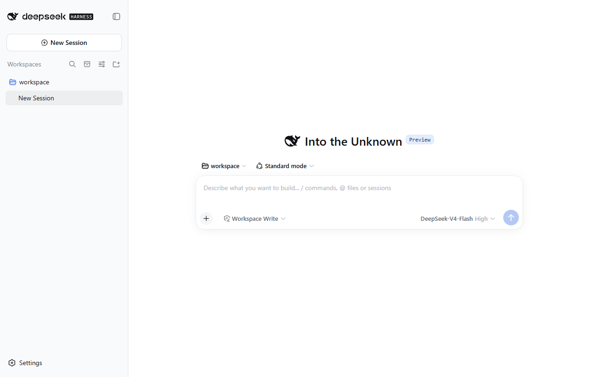
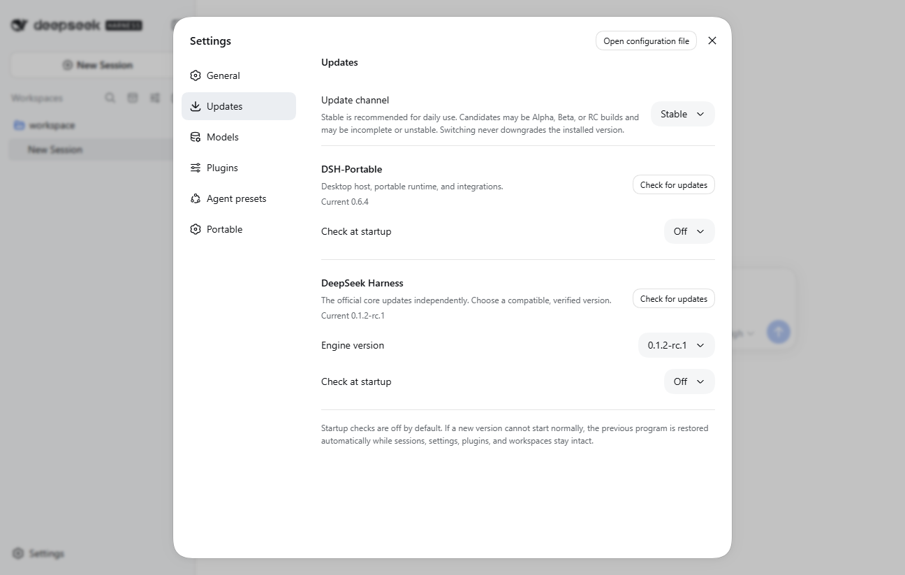
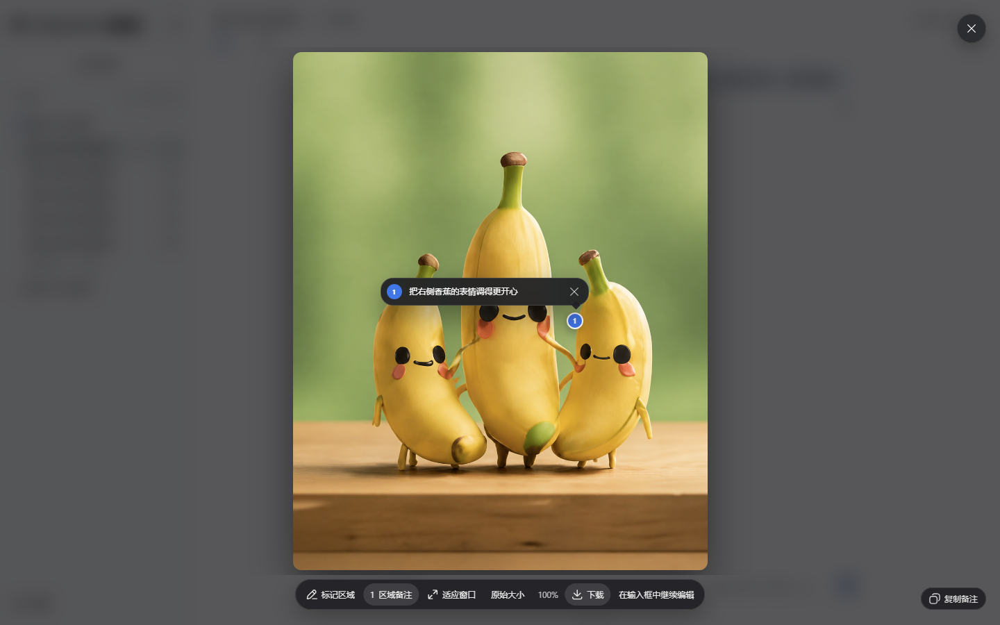

<p align="center">
  
</p>

<h1 align="center">DSH-Portable</h1>

<p align="center">
  <strong>免配环境、界面装插件，把 DSH 工作环境一起带走。</strong><br>
  自带运行环境、桌面窗口和插件市场。会话、设置、插件与默认工作区集中保存，方便移动和备份。
</p>

<p align="center">
  <a href="https://wsl043.github.io/DSH-Portable/"><strong>官网</strong></a>
  · <a href="https://github.com/WSL043/DSH-Portable/releases/latest"><strong>下载</strong></a>
  · <a href="#三步启动">开始使用</a>
  · <a href="docs/move-between-computers.md">迁移</a>
  · <a href="#插件">插件</a>
  · <a href="#获取帮助">帮助</a>
  · <strong>简体中文</strong> · <a href="README.en.md">English</a>
</p>

<p align="center">
  <a href="https://github.com/WSL043/DSH-Portable"></a>
  <a href="https://github.com/WSL043/DSH-Portable/releases/latest"></a>
  <a href="https://github.com/WSL043/DSH-Portable/releases"></a>
  <a href="https://github.com/WSL043/DSH-Portable/actions/workflows/ci.yml"></a>
  <a href="LICENSE"></a>
</p>

<p align="center">
  <a href="https://github.com/WSL043/DSH-Portable/releases/latest/download/DSH-Portable-windows-x64.exe"><strong>下载 Windows 便携版（推荐）</strong></a>
</p>

<p align="center">
  
</p>

> [!NOTE]
> DSH-Portable 是独立社区发行版，不是 DeepSeek 官方桌面应用。它内置经过适配和成品测试的官方 DeepSeek Harness 预览版本。

## 不只是一个桌面窗口

| 免配环境 | 界面装插件 | 环境可移动 | 更新留数据 |
| --- | --- | --- | --- |
| 运行环境随包提供 | 内置 [dsh-market](https://github.com/dsh-market/dsh-market)，搜索后点击安装 | 完全退出后复制目录，同系统同架构继续 | Portable 与内核分别更新，保留会话、设置和插件 |

[查看官网与界面](https://wsl043.github.io/DSH-Portable/) · [直接下载](#下载)

| 产品与内核分别管理 | 默认图片查看器 |
| --- | --- |
|  |  |
| 两套版本各自选择；内核需匹配当前 Portable。截图为候选版，0.6.4 的入口位于通用设置。 | 图集、缩放、原图下载与区域备注，可独立卸载。 |

<details>
<summary>展开：适合谁、运行环境与组件边界</summary>

## 为什么是 Portable

想用 DeepSeek Harness，但不想先配置运行环境、记住启动命令，或每次换电脑都重新整理插件和会话？Portable 把这些日常操作放进一个可移动的桌面工作环境：下载启动器或解压完整包，连接自己的模型服务，就可以开始使用。

| 你想做什么 | 在 Portable 中怎么做 |
| --- | --- |
| **直接开始工作** | 自带 Node.js 和插件工具，通过桌面入口启动，无需先安装开发环境。 |
| **点几下装插件** | 内置插件市场，在设置里搜索、安装和管理插件，常规安装不用输入命令。 |
| **把环境带走** | 完全退出后，复制文件夹到相同操作系统和 CPU 架构的电脑；外部项目需另外搬迁。 |
| **长期保留自己的配置** | 产品更新保留会话、设置、插件和工作区；官方内核与 Portable 分开提供更新。 |
| **像桌面应用一样使用** | 独立窗口、托盘、快捷键、全屏、任务通知和窗口位置恢复。 |
| **出了问题能排查** | 从设置导出脱敏支持报告，或检查并修复可再生的程序组件。 |

如果你已经习惯自行部署官方 DSH、管理运行环境并在终端启动，也可以继续使用上游。Portable 的价值是把安装、桌面操作、移动和维护集中起来；模型能力仍来自你连接的服务。完整离线包可免去首次下载程序组件，但在线模型和新插件下载仍需网络。

| 一个文件夹 | 换位置继续 | 更新不动数据 |
| --- | --- | --- |
| 会话、设置、插件、桌面数据和默认工作区放在一起。 | 退出后复制到另一块硬盘、U 盘或相同平台的电脑，重新打开即可。 | 更新替换可再生的程序组件，保留你的会话、凭据、插件和工作区。 |

运行环境和插件工具随产品放在自己的目录内，目标电脑无需预装 Node.js 或 pnpm，系统 `PATH` 也不会被修改。Portable 仍提供独立窗口、系统托盘、最近会话、任务通知、窗口位置恢复和更新流程。

Windows 开启“任务通知”后，后台任务完成或需要回答、批准时会显示系统通知。完成通知可回复原任务；审批通知提供“拒绝”和“允许一次”，简单单选问题可直接回答，复杂问题会打开对应任务。通知展开由 Windows 控制；任务栏图标统计尚未查看的完成任务，打开或回复后清除。

| 从哪里开始 | Portable 为你处理什么 |
| --- | --- |
| **联网使用** | 下载 76,288 字节（约 74.5 KiB）的启动器，把它放到希望保存的位置后运行；它会在旁边自动准备并校验完整工作目录。 |
| **离线使用** | 完整 ZIP 自带官方 DSH、运行环境、插件市场和插件管理工具。 |
| **同平台换电脑或 U 盘** | 复制文件夹即可；启动时修正由 Portable 管理的旧路径。 |
| **只迁移个人数据** | 导出同一份迁移内容，可选择普通包或密码加密的私密包。 |
| **长期更新** | DSH-Portable 与官方 DSH 内核分开更新，均保留 `data` 和 `workspace`。 |
| **出现异常** | 内置只读检查、保留数据的精准修复和脱敏支持报告。 |

已发布的 0.6.4 Windows 离线 ZIP 为 **56,409,457 字节（约 53.8 MiB）**，Windows 引导 EXE 为 **76,288 字节（约 74.5 KiB）**。官方 DSH 运行环境以一个经过校验的紧凑包随附，首次在本机准备，之后复用；会话、设置、插件和工作区仍在 Portable 文件夹中。这样保留完整插件运行时，也减少复制和更新要处理的小文件。

### 组件边界与发布节奏

DSH-Portable 的桌面壳、便携目录、更新、修复和迁移流程由本项目维护；官方 DSH 是随包锁定并单独验证的上游内核。两者使用独立版本和发布节奏，Portable 功能版本不等于官方内核版本，任一方的新版本都应以对应 Release 说明为准。

聊天工作台、模型配置和通用设置沿用官方 DSH。Portable 的改动聚焦窗口与托盘、运行环境、更新、迁移和恢复；上游页面仅在 Portable 集成确有兼容问题时做必要适配。

插件市场和两个默认插件属于 Portable 集成组件；市场目录主要收录社区插件，收录不代表官方认可或安全审计。只有默认插件按锁定版本经过本项目的成品验证，其他插件请自行评估并按需安装。对应 Release 说明或验证范围没有列出的兼容性，不视为 Portable 的承诺。

</details>

## 三步启动

1. 下载 [**Windows 便携启动器**](https://github.com/WSL043/DSH-Portable/releases/latest/download/DSH-Portable-windows-x64.exe)。
2. 把启动器放到希望保存的位置并双击运行，它会在旁边准备一个完整的 `DSH-Portable` 文件夹。
3. 在界面中连接模型。以后直接运行文件夹里的 `DeepSeek-Herness.exe`。

右上角关闭按钮默认把应用收进系统托盘，运行中的任务会继续。需要完全退出时，优先使用原生 **文件 → 退出 DeepSeek Harness**；Windows 可按 `Ctrl+Q`，托盘右键的 **退出 DeepSeek Harness** 是备用路径。

## 下载

### Windows

| 适合你，如果… | 下载 |
| --- | --- |
| 想要可移动、自动准备的工作文件夹 | [**便携启动器**](https://github.com/WSL043/DSH-Portable/releases/latest/download/DSH-Portable-windows-x64.exe)（推荐，76,288 字节，约 74.5 KiB） |
| 目标电脑无法联网，或需要手动解压 | [完整离线 ZIP](https://github.com/WSL043/DSH-Portable/releases/latest/download/DSH-Portable-windows-x64-offline.zip) |

### macOS

| 电脑 | 便携 ZIP |
| --- | --- |
| Apple Silicon（arm64） | [下载](https://github.com/WSL043/DSH-Portable/releases/latest/download/DSH-Portable-macos-arm64.zip) |
| Intel Mac | [下载](https://github.com/WSL043/DSH-Portable/releases/latest/download/DSH-Portable-macos-x64.zip) |

macOS 包采用临时签名，尚未经过 Apple 公证。首次打开若被阻止，请按住 Control 点按应用，再选择 **打开**。

### Linux

| 电脑 | AppImage（推荐） | 完整便携目录 |
| --- | --- | --- |
| Intel / AMD（x64） | [下载](https://github.com/WSL043/DSH-Portable/releases/latest/download/DeepSeek-Herness-linux-x64.AppImage) | [下载](https://github.com/WSL043/DSH-Portable/releases/latest/download/DSH-Portable-linux-x64.tar.gz) |
| ARM64 | [下载](https://github.com/WSL043/DSH-Portable/releases/latest/download/DeepSeek-Herness-linux-arm64.AppImage) | [下载](https://github.com/WSL043/DSH-Portable/releases/latest/download/DSH-Portable-linux-arm64.tar.gz) |

```bash
chmod +x DeepSeek-Herness-linux-x64.AppImage
./DeepSeek-Herness-linux-x64.AppImage
```

AppImage 的会话、设置、插件和工作区保存在旁边的 `DSH-Portable-data` 文件夹；移动或备份时把两者一起复制。

完整便携目录中的 `DeepSeek-Herness` 是可直接运行的 Linux ELF；部分文件管理器会显示通用可执行文件图标。需要桌面图标和应用菜单集成时，请使用上面的 AppImage。

## 移动与备份

完整步骤、数据包迁移和无需第二台电脑的验证方法见[跨电脑迁移指南](docs/move-between-computers.md)。

1. 优先从原生文件菜单选择 **退出 DeepSeek Harness**；Windows 也可按 `Ctrl+Q`，或从托盘选择备用的 **退出 DeepSeek Harness**，等窗口和托盘图标消失。
2. 在相同平台的新位置复制整个 `DSH-Portable` 文件夹。
3. 在新位置运行 `DeepSeek-Herness.exe`（Windows）或对应平台入口。

启动器会修正它管理的旧路径；你主动打开的外部项目仍保留原位置。两台电脑同步同一目录前，请先在两边完全退出，避免同时写入会话文件。

完整目录复制只适用于相同操作系统和 CPU 架构；更换操作系统或架构时，请下载对应目标包，再用数据归档迁移会话、设置和插件配置。原生插件依赖需在目标平台重建，外部 workspace 需自行搬迁或重新连接；跨操作系统恢复尚未通过成品验收。

## 插件

打开 **设置 → 插件 → 插件市场**，可以搜索、筛选、查看项目主页，并安装、更新、停用或卸载社区插件。市场跟随 DSH 的中文/英文和明暗外观，不会为了安装插件静默中断正在运行的任务。

**常规安装不需要打开终端或输入代码。** 搜索插件，打开详情，再点击安装；需要刷新或重启时按页面提示操作即可。插件市场基于上游 [dsh-market](https://github.com/dsh-market/dsh-market) 融入 Portable。

可选 Provider：[Codex Subscription](https://github.com/WSL043/dsh-codex-subscription) 可通过现有插件市场或标准 DSH 命令连接 ChatGPT/Codex 订阅；不会默认安装。

全新安装仅预装两个经过审核、可自行卸载的插件，当前稳定版本为：[Image Viewer](https://github.com/WSL043/dsh-image-viewer) **0.1.0** 提供图集、缩放、拖动、下载和区域标注；[Chat Manager](https://github.com/WSL043/dsh-chat-manager) **1.3.3** 提供归档搜索、恢复及带确认的会话删除。其他社区插件仍按需从插件市场或通过标准 DSH 命令安装。普通升级会完整保留现有 Profile 及其中已安装或已移除的插件；如果你卸载了任一默认插件，后续启动或升级不会自动装回。

<details>
<summary>进阶：通过 DSH 终端管理插件</summary>

Windows 可双击 `dsh.exe`，或从托盘的 **更多 → DSH 终端** 打开；macOS 可从应用菜单打开 **DSH 终端**；Linux 可从托盘打开 **DSH 终端**。在这个专用终端里，按插件文档提供的标准 DSH 命令可以原样粘贴：

```powershell
dsh plugin --profile web add <插件>
dsh plugin --profile web list --depth 0
dsh plugin --profile web update <插件包名>
dsh plugin --profile web remove <插件包名>
dsh --profile web --dump-config
```

便携版的 DSH 终端只在当前窗口临时识别 `dsh`，不会修改系统 `PATH`。移动整个 Portable 文件夹后，新开的 DSH 终端会自动使用新位置，不需要修复环境变量。

</details>

能安全热加载的插件会立即生效，纯界面插件只需刷新；已经载入宿主代码的插件更新会标记为待重启。市场不会在任务运行时更新、卸载或偷偷重启 DSH。只安装你信任的插件。

<details>
<summary>桌面快捷键、更新修复和目录说明</summary>

## Windows 桌面操作


原生导航栏支持亮暗主题、侧栏折叠和前进后退。


启动期间只显示原生 Logo、加载动画和阶段说明，工作台准备完成后一次性交接；加载页与菜单遵循已保存的亮暗主题。左上角的“文件 / 视图 / 帮助”菜单提供常用桌面操作。

| 操作 | 快捷键 |
| --- | --- |
| 折叠侧栏 / 后退 / 前进 | `Ctrl+B` / `Alt+←` / `Alt+→` |
| 新会话 / 设置 | `Ctrl+N` / `Ctrl+,` |
| 只重新加载界面，后台任务继续 | `Ctrl+R` 或 `F5` |
| 放大 / 缩小 / 实际大小 | `Ctrl++` / `Ctrl+-` / `Ctrl+0` |
| 切换全屏 / 退出全屏 | `F11` / `Esc` |
| 关闭窗口 / 退出程序 | `Ctrl+W` / `Ctrl+Q` |
| 打开文件 / 视图 / 帮助菜单 | `Alt+F` / `Alt+V` / `Alt+H` |

退出全屏会恢复原来的窗口位置与最大化状态。普通窗口中的 `Esc` 继续用于页面弹窗；需要完全退出时，优先使用文件菜单中的 **退出 DeepSeek Harness**，托盘退出命令是备用路径。帮助菜单可检查产品和内核更新、打开日志目录及反馈问题。

## 更新与修复

> 下图和独立更新设置页说明对应 0.6.5-rc.1 候选版；已发布的 0.6.4 请从「设置 → 通用设置 → 便携版」进入。


- DSH-Portable 会先打开本地工作台；只有对应的“启动时检查更新”已开启时，才会在后台检查更新。产品更新与官方 DeepSeek Harness 内核更新各自独立，两个启动检查默认关闭；**设置 → 更新** 是主要更新入口：可分别检查 DSH-Portable 和官方 DeepSeek Harness 内核，检查后在页面内经桌面宿主确认即可安装更新；两者的检查和安装操作独立，但共享稳定版/候选版偏好。
- 更新通道可选**稳定版**或**候选版**。稳定版适合日常使用；候选通道按实际成熟度提供 Alpha、Beta 或 RC，并且都必须先通过对应的 Portable 成品验证。切换通道不会自动降级当前版本。各阶段含义见[发布阶段规则](docs/release-policy.md)。
- 托盘菜单提供备用的两种手动检查；检查完成、等待选择和实际更新是不同状态，不会一直停在“正在检查”。
- 更新提示会明确写出正在更新 DSH-Portable 还是 DeepSeek Harness，并显示对应的当前版本和目标版本。
- 一般更新只下载变化的 DSH 应用组件，并显示真实下载百分比；会话、设置、凭据和工作区全部保留。
- 运行环境兼容性变化时，会直接下载经过验证的完整版本并原地更新，仍然保留用户数据。
- 可以选择稍后或**跳过此版本**；安装前会确认没有任务运行。替换内核前会先用新内核检查现有 Profile 和插件能否组合启动；不兼容时保持当前版本不变。更新后只有工作台真正就绪才会提交新版本，启动失败或超时会自动恢复更新前的程序，同时保留会话、设置、插件和工作区。
- 「设置 → 更新」可分别选择 Portable 与官方内核版本。Portable 历史目录从 0.6.5-rc.1 开始保留经过成品验收的版本；更早版本不自动加入，已知问题版本会从可选目录排除。

内核列表以当前 Portable 版本对应的成品验证结果为准，并非上游所有版本都立即可选。目前内核更新包要求匹配 Portable 版本；例如面向 0.6.4 的包不能直接用于 0.6.5-rc.1，升级到正式 0.6.5 也不会自动解除限制，需要该版本对应的已验证内核包。

- **设置 → Portable** 提供检查、修复和脱敏支持报告。启动轨迹和桌面／后台健康采样按启动批次保存在 `data/logs/history/`，默认保留 14 天内最近 30 次，总量上限 32 MiB；单类日志按 128 KiB 轮转。支持报告包含多次启动的脱敏历史，导出达到大小限制时会明确标记截断，本地历史仍可供进一步排查。反馈启动慢或启动失败时请优先附上该报告，不要直接发送可能含登录令牌的原始日志。修复保留用户数据，只重建可再生组件。

官方 DSH 版本每小时从官方 npm 发现。每个发现的版本都记录不可变的包完整性和官方源码来源，并在五个目标平台（Windows x64、macOS arm64、macOS x64、Linux x64、Linux arm64）完成成品资格验证。目录优先处理最新缺失版本；历史回填仅支持不超过 20 个版本的窗口。失败版本不会替换已接受的目录。兼容的官方版本可独立进入内核通道，无需发布新的 DSH-Portable 版本；官方发布不会直接替换正在使用的工作环境，两条发布线的版本号和时间可以不同。

发布说明的写法和证据要求见 [Release 写作规范](docs/release-writing.md)。

## 文件夹里有什么

根目录的 `README.txt` 是统一入口；中英文使用说明和迁移命令收在 `docs/`，许可及组件版本收在 `licenses/`。日常只需打开 `DeepSeek-Herness.exe`，或使用 `dsh.exe` 进入终端。`app/`、`launcher/`、`runtime/` 和 `default-plugins/` 是程序组件，请保持在原位置。

## 便携数据

正常更新会原地保留 `data` 和 `workspace`。需要迁入新的 Portable 环境时，可在**设置 → Portable → 数据与迁移**选择「导出迁移包」或「导出加密私密包」。两者内容相同，都包含会话、设置、插件配置和 API 凭据；只有后者需要密码才能读取。未加密包只应保存在信任的设备上，它仍是带完整性校验的压缩容器而不是文本文件。运行时、缓存、日志和工作区文件不会被塞进迁移包。导入会恢复插件依赖并验证 Profile；任何失败都会自动恢复导入前的数据。

成品 `docs/` 目录的 `DATA-MIGRATION.zh-CN.txt` 提供中文检查和恢复命令；`DATA-MIGRATION.en.txt` 提供独立英文说明。恢复默认只补入缺失数据；明确选择覆盖时，先在 `data/backups/` 生成回滚副本。

| 路径 | 内容 |
| --- | --- |
| `data/dsh-home/` | 设置、模型凭据、会话和插件 |
| `data/webview2/` | Windows 桌面窗口数据 |
| `workspace/` | 默认工作区 |
| `data/logs/` | 本地服务与启动日志 |


## 安全

DSH 具备本地代码执行能力，请只使用可信模型、插件和项目。本地服务只绑定 `127.0.0.1`，便携外壳默认关闭 DSH 遥测。`data` 可能包含 API 凭据和私人会话；请妥善保管，Windows 移动盘优先使用 NTFS。

查看完整的[隐私说明](PRIVACY.md)、[安全策略](SECURITY.md)和[代码签名策略](CODE_SIGNING.md)。当前 Windows Release 尚未签名；SignPath Foundation 的开源签名申请正在进行中。

</details>

## 获取帮助

- [提交 Bug 报告](https://github.com/WSL043/DSH-Portable/issues/new?template=bug-report.yml)
- [提出功能建议](https://github.com/WSL043/DSH-Portable/issues/new?template=feature-request.yml)
- [参与讨论](https://github.com/WSL043/DSH-Portable/discussions)

内置 DSH 0.1.2-rc.1 存在已知网络兼容限制：Clash/Mihomo 的 Fake-IP DNS 可能使 `web_fetch` 返回 `WEB_BLOCKED_URL`。相关进展见[上游说明](https://github.com/deepseek-ai/deepseek-harness/discussions/5202)。

请勿在 Issue 中粘贴 API Key、登录凭据或私人会话。

## 开源与贡献

DSH-Portable 使用标准 [Apache-2.0 许可证](LICENSE)。你可以使用、修改和再分发，但需要保留许可证、版权与变更声明。源码和每个平台的成品还会携带 [NOTICE.md](NOTICE.md)，明确标出本项目的规范来源与第三方组件边界。

修复和改进欢迎直接提交 Pull Request。开始前请阅读 [CONTRIBUTING.md](CONTRIBUTING.md)，避免重复实现官方 DSH 已有的能力。

<details>
<summary><strong>从源码构建</strong></summary>

```powershell
./scripts/build-windows.ps1
```

```bash
bash scripts/build-macos.sh arm64   # 或 x64
bash scripts/build-linux.sh x64     # 或 arm64
```

依赖、发布内容和成品测试均由仓库固定。普通用户无需手动比较校验值；需要时可从 Release 下载 `checksums.txt`。新构建还会生成绑定源码提交和验收工作流的 GitHub/Sigstore 证明，高级用户可运行 `gh attestation verify <下载文件> -R WSL043/DSH-Portable` 验证来源。

</details>

如果 DSH-Portable 对你有帮助，欢迎在仓库右上角点击 **Star** 收藏项目。[打开 GitHub 仓库](https://github.com/WSL043/DSH-Portable)，也可以把它分享给需要免配环境、界面装插件或迁移工作环境的朋友。

DeepSeek Harness、DeepSeek 名称与标志归 DeepSeek 所有。DSH-Portable 由 WSL043 独立维护，未获 DeepSeek 背书。
