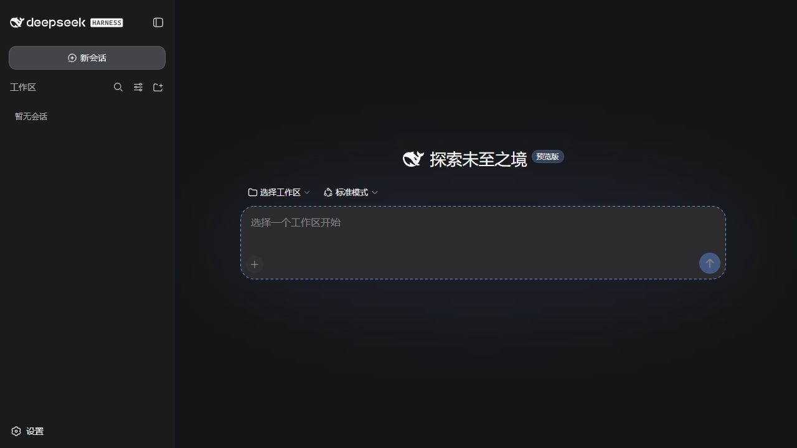

<p align="center">
  
</p>

<h1 align="center">DSH-Portable</h1>

<p align="center">
  <strong>把整个 DeepSeek Harness 工作环境带走。</strong><br>
  会话、设置、插件和工作区放在一起，复制一个文件夹就能继续工作。
</p>

<p align="center">
  <a href="https://wsl043.github.io/DSH-Portable/"><strong>官网</strong></a>
  · <a href="https://github.com/WSL043/DSH-Portable/releases/latest"><strong>下载</strong></a>
  · <a href="#三步启动">开始使用</a>
  · <a href="#插件">插件</a>
  · <a href="#获取帮助">帮助</a>
  · <strong>简体中文</strong> · <a href="README.en.md">English</a>
</p>

<p align="center">
  <a href="https://github.com/WSL043/DSH-Portable/releases/latest"></a>
  <a href="https://github.com/WSL043/DSH-Portable/releases"></a>
  
  <a href="https://github.com/WSL043/DSH-Portable/stargazers"></a>
  <a href="LICENSE"></a>
</p>

<p align="center">
  <a href="https://github.com/WSL043/DSH-Portable/releases/latest/download/DSH-Portable-windows-x64.exe"><strong>下载 Windows 便携版（推荐）</strong></a>
</p>

<p align="center">
  
</p>

> [!NOTE]
> DSH-Portable 是独立社区发行版，不是 DeepSeek 官方桌面应用。它内置经过适配和成品测试的官方 DeepSeek Harness 预览版本。

## 为什么是 Portable

| 一个文件夹 | 换位置继续 | 更新不动数据 |
| --- | --- | --- |
| 会话、设置、插件、桌面数据和默认工作区放在一起。 | 退出后复制到另一块硬盘、U 盘或电脑，重新打开即可。 | 更新替换可再生的程序组件，保留你的会话、凭据、插件和工作区。 |

同时保留桌面程序该有的体验：独立窗口、系统托盘、最近会话、任务完成通知、自动恢复窗口位置，以及不打断运行任务的更新流程。

## 三步启动

1. 下载 [**Windows 便携启动器**](https://github.com/WSL043/DSH-Portable/releases/latest/download/DSH-Portable-windows-x64.exe)。
2. 双击运行并选择位置，它会准备一个完整的 `DSH-Portable` 文件夹。
3. 在界面中连接模型。以后直接运行文件夹里的 `DeepSeek-Herness.exe`。

右上角关闭按钮默认把应用收进系统托盘，运行中的任务会继续。需要完全退出时，右键托盘图标并选择 **退出 DeepSeek Harness**。

## 下载

### Windows

| 适合你，如果… | 下载 |
| --- | --- |
| 想要可移动、自动准备的工作文件夹 | [**便携启动器**](https://github.com/WSL043/DSH-Portable/releases/latest/download/DSH-Portable-windows-x64.exe)（推荐，约 55 KB） |
| 目标电脑无法联网，或需要手动解压 | [完整离线 ZIP](https://github.com/WSL043/DSH-Portable/releases/latest/download/DSH-Portable-windows-x64-offline.zip) |
| 想像普通软件一样安装和卸载 | [Windows 安装版](https://github.com/WSL043/DSH-Portable/releases/latest/download/DeepSeek-Herness-Setup.exe) |

### macOS

| 电脑 | DMG（推荐） | 便携 ZIP |
| --- | --- | --- |
| Apple Silicon（M1–M4） | [下载](https://github.com/WSL043/DSH-Portable/releases/latest/download/DeepSeek-Herness-macos-arm64.dmg) | [下载](https://github.com/WSL043/DSH-Portable/releases/latest/download/DSH-Portable-macos-arm64.zip) |
| Intel Mac | [下载](https://github.com/WSL043/DSH-Portable/releases/latest/download/DeepSeek-Herness-macos-x64.dmg) | [下载](https://github.com/WSL043/DSH-Portable/releases/latest/download/DSH-Portable-macos-x64.zip) |

macOS 包采用临时签名，尚未经过 Apple 公证。首次打开若被阻止，请按住 Control 点按应用，再选择 **打开**。

### Linux

| 电脑 | AppImage（推荐） | 完整便携目录 |
| --- | --- | --- |
| Intel / AMD（x64） | [下载](https://github.com/WSL043/DSH-Portable/releases/latest/download/DeepSeek-Herness-linux-x64.AppImage) | [下载](https://github.com/WSL043/DSH-Portable/releases/latest/download/DSH-Portable-linux-x64.tar.gz) |
| ARM64 | [下载](https://github.com/WSL043/DSH-Portable/releases/latest/download/DeepSeek-Herness-linux-arm64.AppImage) | [下载](https://github.com/WSL043/DSH-Portable/releases/latest/download/DSH-Portable-linux-arm64.tar.gz) |

```bash
chmod +x DeepSeek-Herness-linux-x64.AppImage
./DeepSeek-Herness-linux-x64.AppImage
```

AppImage 的会话、设置、插件和工作区保存在旁边的 `DSH-Portable-data` 文件夹；移动或备份时把两者一起复制。

## 移动与备份

1. 从托盘选择 **退出 DeepSeek Harness**，等窗口和托盘图标消失。
2. 复制整个 `DSH-Portable` 文件夹。
3. 在新位置运行 `DeepSeek-Herness.exe`（Windows）或对应平台入口。

启动器会修正它管理的旧路径；你主动打开的外部项目仍保留原位置。两台电脑同步同一目录前，请先在两边完全退出，避免同时写入会话文件。

## 插件

打开 **设置 → 插件 → 插件市场**，可以搜索、筛选、查看项目主页，并安装、更新、停用或卸载社区插件。市场跟随 DSH 的中文/英文和明暗外观，不会为了安装插件静默中断正在运行的任务。

全新安装包含可停用或卸载的[永久删除会话](https://github.com/WSL043/dsh-native-session-manager)插件。永久删除始终需要二次确认，也不会替代可恢复的“归档”。普通升级不会重新安装用户已经移除的插件。

`dsh.exe` 是高级用户的命令行入口，不是第二个桌面启动器：

```powershell
.\dsh.exe plugin --profile web add <插件>
.\dsh.exe plugin --profile web list --depth 0
.\dsh.exe plugin --profile web update <插件包名>
.\dsh.exe plugin --profile web remove <插件包名>
.\dsh.exe --profile web --dump-config
```

能安全热加载的插件会立即生效，纯界面插件只需刷新；已经载入宿主代码的插件更新会标记为待重启。市场不会在任务运行时更新、卸载或偷偷重启 DSH。只安装你信任的插件。

## 更新与修复

- DSH-Portable 会先打开本地工作台，再在后台检查更新。自动检查更新默认关闭；托盘菜单随时可以手动检查或开启**启动时检查更新**。
- 更新窗口会分别显示 DSH-Portable 产品版本和内置官方 DSH 版本。
- 每次提示的是 DSH-Portable 的产品版本；内置官方 DSH 的版本和这次是否变化会单独列出。
- 一般更新只下载变化的 DSH 应用组件，并显示真实下载百分比；会话、设置、凭据和工作区全部保留。
- 运行环境兼容性变化时，会直接下载经过验证的完整版本并原地更新，仍然保留用户数据。
- 可以选择稍后或**跳过此版本**；安装前确认没有任务运行，失败时恢复更新前版本。
- **设置 → 通用设置 → 便携版** 提供检查、修复和支持报告。修复保留用户数据，只重建可再生组件。

官方 DSH 更新不会直接替换正在使用的工作环境。新版会先经过 Windows、macOS、Linux x64/ARM64 的成品测试，再进入 DSH-Portable 更新通道。

## 便携数据

| 路径 | 内容 |
| --- | --- |
| `data/dsh-home/` | 设置、模型凭据、会话和插件 |
| `data/webview2/` | Windows 桌面窗口数据 |
| `workspace/` | 默认工作区 |
| `data/logs/` | 本地服务与启动日志 |

安装版把相同数据放在 `%LOCALAPPDATA%\DeepSeek-Herness`，卸载应用时不会自动删除。

## 安全

DSH 具备本地代码执行能力，请只使用可信模型、插件和项目。本地服务只绑定 `127.0.0.1`，便携外壳默认关闭 DSH 遥测。`data` 可能包含 API 凭据和私人会话；请妥善保管，Windows 移动盘优先使用 NTFS。

查看完整的[隐私说明](PRIVACY.md)和[代码签名状态](CODE_SIGNING.md)。当前 Windows Release 尚未签名；SignPath Foundation 的开源签名申请正在进行中。

## 获取帮助

- [提交 Bug 报告](https://github.com/WSL043/DSH-Portable/issues/new?template=bug-report.yml)
- [提出功能建议](https://github.com/WSL043/DSH-Portable/issues/new?template=feature-request.yml)
- [参与讨论](https://github.com/WSL043/DSH-Portable/discussions)

请勿在 Issue 中粘贴 API Key、登录凭据或私人会话。

## 开源与贡献

DSH-Portable 使用标准 [MIT 许可证](LICENSE)。你可以使用、修改和再分发，但需要保留许可证中的版权与许可声明。源码和每个平台的成品还会携带 [NOTICE.md](NOTICE.md)，明确标出本项目的规范来源与第三方组件边界。

修复和改进欢迎直接提交 Pull Request。开始前请阅读 [CONTRIBUTING.md](CONTRIBUTING.md)，避免重复实现官方 DSH 已有的能力。

<details>
<summary><strong>从源码构建</strong></summary>

```powershell
./scripts/build-windows.ps1
```

```bash
bash scripts/build-macos.sh arm64   # 或 x64
bash scripts/build-linux.sh x64     # 或 arm64
```

依赖、发布内容和成品测试均由仓库固定。普通用户无需手动比较校验值；需要时可从 Release 下载 `checksums.txt`。

</details>

如果 DSH-Portable 对你有帮助，欢迎点一个 [**Star**](https://github.com/WSL043/DSH-Portable/stargazers)。它会帮助更多需要便携 DSH 的用户找到这个项目。

DeepSeek Harness、DeepSeek 名称与标志归 DeepSeek 所有。DSH-Portable 由 WSL043 独立维护，未获 DeepSeek 背书。
