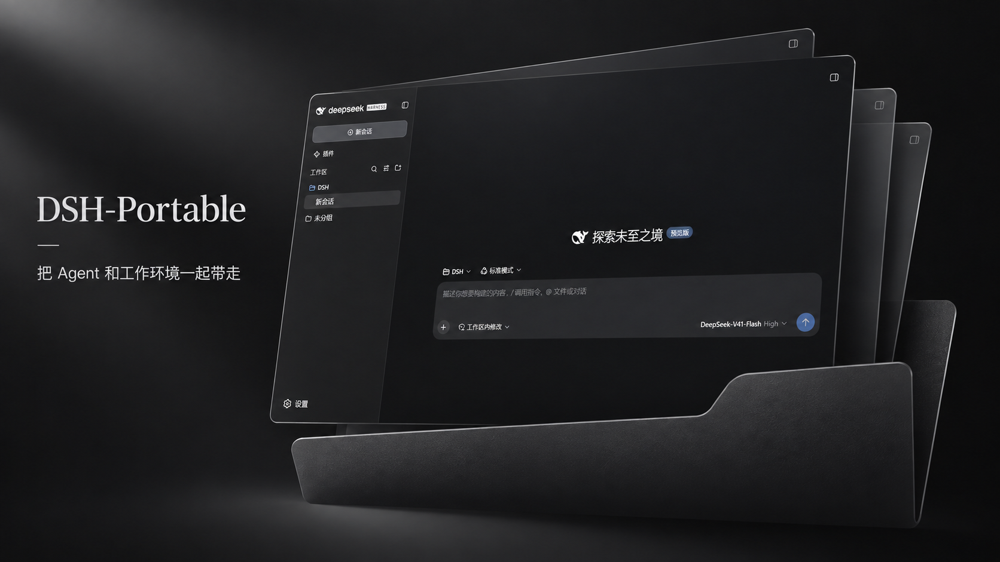

<p align="center">
  
</p>

<h1 align="center">DSH-Portable</h1>

<p align="center">
  <strong>DeepSeek Harness 便携版：整个文件夹拷到 U 盘，换一台电脑接着用。</strong><br>
  会话、设置、插件和工作区都在文件夹里；不安装、不改系统，Windows / macOS / Linux。
</p>

<p align="center">
  <a href="https://wsl043.github.io/DSH-Portable/"><strong>官网</strong></a>
  · <a href="https://github.com/WSL043/DSH-Portable/releases/latest"><strong>下载</strong></a>
  · <a href="#三步启动">开始使用</a>
  · <a href="docs/user-guide.zh-CN.md">用户指南</a>
  · <a href="#插件">插件</a>
  · <a href="#获取帮助">帮助</a>
  · <strong>简体中文</strong> · <a href="README.en.md">English</a>
</p>

<p align="center">
  <a href="https://github.com/WSL043/DSH-Portable"></a>
  <a href="https://github.com/WSL043/DSH-Portable/releases/latest"></a>
  <a href="https://github.com/WSL043/DSH-Portable/releases"></a>
  <a href="https://github.com/WSL043/DSH-Portable/actions/workflows/ci.yml"></a>
  <a href="LICENSE"></a>
</p>

<p align="center">
  <a href="https://github.com/WSL043/DSH-Portable/releases/latest/download/DSH-Portable-windows-x64.exe"><strong>下载 Windows 便携版</strong></a>
</p>

<p align="center">
  
</p>

> DSH-Portable 是独立社区发行版，不是 DeepSeek 官方应用，未获 DeepSeek 背书。<br>
> DeepSeek 已提供[官方桌面端](https://www.deepseek.com/harness/)；两种选择各有侧重。

## 该选哪个

| | 官方桌面端 | DSH-Portable |
| --- | --- | --- |
| 安装与平台 | 安装式；Windows、macOS | 绿色便携；Windows、macOS、Linux，不安装、不改系统 PATH |
| 更新节奏 | 跟随官方发布节奏 | Portable 与内核分开更新，可选内核版本 |
| 携带与维护 | 常规桌面安装 | 完全退出后可把整个文件夹复制到 U 盘或另一台相同平台的电脑；提供保留数据的回滚与恢复工具 |
| 插件 | 官方插件管理 | 同样的插件管理，另带插件市场入口和两个默认插件 |
| 适合你，如果… | 想装进系统、主要使用一台电脑 | 想带走、多设备使用，或需要可控更新 |

## 下载

日常使用请选择稳定版 0.x（Native）。1.0 线有一个仅 Windows 的 [alpha 预览版](https://github.com/WSL043/DSH-Portable/releases/tag/v1.0.0-alpha.5)，供想尝鲜的用户试用，不是 0.x 的升级路径。

### Windows

| 需要 | 下载 |
| --- | --- |
| 联网自动准备文件夹 | [在线便携启动器](https://github.com/WSL043/DSH-Portable/releases/latest/download/DSH-Portable-windows-x64.exe)（推荐） |
| 自行下载并解压 | [标准 ZIP](https://github.com/WSL043/DSH-Portable/releases/latest/download/DSH-Portable-windows-x64-offline.zip) |
| 目标电脑缺少 WebView2 且无法联网补装 | [完整离线 ZIP](https://github.com/WSL043/DSH-Portable/releases/latest/download/DSH-Portable-windows-x64-complete-offline.zip) |

不知道怎么选？能联网用在线启动器；想自行解压用标准 ZIP。Windows 11 预装 WebView2，多数 Windows 10 电脑也已有；完整离线 ZIP 自带它。更多[离线部署要求](docs/user-guide.zh-CN.md#离线部署)。

### macOS

[Apple Silicon（arm64）](https://github.com/WSL043/DSH-Portable/releases/latest/download/DSH-Portable-macos-arm64.zip) · [Intel（x64）](https://github.com/WSL043/DSH-Portable/releases/latest/download/DSH-Portable-macos-x64.zip) · [首次打开说明](docs/user-guide.zh-CN.md#macos)

### Linux

| 架构 | AppImage | 完整便携目录 |
| --- | --- | --- |
| Intel / AMD（x64） | [下载](https://github.com/WSL043/DSH-Portable/releases/latest/download/DeepSeek-Herness-linux-x64.AppImage) | [下载](https://github.com/WSL043/DSH-Portable/releases/latest/download/DSH-Portable-linux-x64.tar.gz) |
| ARM64 | [下载](https://github.com/WSL043/DSH-Portable/releases/latest/download/DeepSeek-Herness-linux-arm64.AppImage) | [下载](https://github.com/WSL043/DSH-Portable/releases/latest/download/DSH-Portable-linux-arm64.tar.gz) |

AppImage 与完整目录的启动和数据位置见[Linux 使用说明](docs/user-guide.zh-CN.md#linux)。

## 三步启动

1. 下载 [Windows 便携启动器](https://github.com/WSL043/DSH-Portable/releases/latest/download/DSH-Portable-windows-x64.exe)。
2. 将它放到希望保存的位置并运行；它会在旁边准备完整的 DSH-Portable 文件夹。
3. 连接模型服务；以后运行文件夹里的 DeepSeek-Herness.exe。

macOS、Linux 解压后直接运行，首次打开的注意事项见[用户指南](docs/user-guide.zh-CN.md#macos)。

关闭按钮默认将应用收进托盘，任务会继续。完全退出请用 **文件 → 退出 DeepSeek Harness**；Windows 可按 Ctrl+Q，托盘菜单提供备用退出。

## 它怎么做便携

- **一个文件夹**：会话、设置、插件和默认工作区集中保存；目录与迁移细节见[用户指南](docs/user-guide.zh-CN.md#便携数据)。
- **换位置继续**：完全退出后，可把整个文件夹复制到 U 盘或另一台相同系统和架构的电脑；见[迁移步骤](docs/user-guide.zh-CN.md#移动与备份)。
- **更新不动数据**：Portable 与官方内核分别更新，内核版本可选；更新、跳过、回滚规则见[用户指南](docs/user-guide.zh-CN.md#更新与修复)。
- **出问题可恢复**：检查、精准修复、支持报告和 DSH-Recovery.exe 保留个人数据；见[恢复说明](docs/user-guide.zh-CN.md#dsh-recoveryexe)。

## 插件

全新安装默认附带两个可卸载插件：[Image Viewer](https://github.com/WSL043/dsh-image-viewer)（缩放、图库、原图下载与区域标注）和 [Chat Manager](https://github.com/WSL043/dsh-chat-manager)（搜索归档、恢复与安全删除会话）。

更多插件在 **设置 → 插件 → 插件市场** 搜索安装；手动添加时在 **插件 → 添加插件** 填包名或地址，不要粘贴终端命令。详见[插件指南](docs/user-guide.zh-CN.md#插件)。

## 内核版本可选

<!-- core-support:start -->
**可选内核（最新 3 个已验证版本）** · 设置 → 更新 · 正式版 0.6.5 起支持（首发 0.6.5-rc.1）。

<details>
<summary>查看 Portable 0.8.9 的可选内核</summary>

| 平台 | 可选内核 |
| --- | --- |
| Windows x64 | [0.2.1-alpha.2](https://github.com/WSL043/DSH-Portable-Updates/releases/download/update-channel-core-stable/dsh-core-index-windows-x64.json), [0.2.1-alpha.1](https://github.com/WSL043/DSH-Portable-Updates/releases/download/update-channel-core-stable/dsh-core-index-windows-x64.json), [0.2.0-rc.2](https://github.com/WSL043/DSH-Portable-Updates/releases/download/update-channel-core-stable/dsh-core-index-windows-x64.json) |
| macOS arm64 | [0.2.1-alpha.2](https://github.com/WSL043/DSH-Portable-Updates/releases/download/update-channel-core-stable/dsh-core-index-macos-arm64.json), [0.2.1-alpha.1](https://github.com/WSL043/DSH-Portable-Updates/releases/download/update-channel-core-stable/dsh-core-index-macos-arm64.json), [0.2.0-rc.2](https://github.com/WSL043/DSH-Portable-Updates/releases/download/update-channel-core-stable/dsh-core-index-macos-arm64.json) |
| macOS x64 | [0.2.1-alpha.2](https://github.com/WSL043/DSH-Portable-Updates/releases/download/update-channel-core-stable/dsh-core-index-macos-x64.json), [0.2.1-alpha.1](https://github.com/WSL043/DSH-Portable-Updates/releases/download/update-channel-core-stable/dsh-core-index-macos-x64.json), [0.2.0-rc.2](https://github.com/WSL043/DSH-Portable-Updates/releases/download/update-channel-core-stable/dsh-core-index-macos-x64.json) |
| Linux x64 | [0.2.1-alpha.2](https://github.com/WSL043/DSH-Portable-Updates/releases/download/update-channel-core-stable/dsh-core-index-linux-x64.json), [0.2.1-alpha.1](https://github.com/WSL043/DSH-Portable-Updates/releases/download/update-channel-core-stable/dsh-core-index-linux-x64.json), [0.2.0-rc.2](https://github.com/WSL043/DSH-Portable-Updates/releases/download/update-channel-core-stable/dsh-core-index-linux-x64.json) |
| Linux arm64 | [0.2.1-alpha.2](https://github.com/WSL043/DSH-Portable-Updates/releases/download/update-channel-core-stable/dsh-core-index-linux-arm64.json), [0.2.1-alpha.1](https://github.com/WSL043/DSH-Portable-Updates/releases/download/update-channel-core-stable/dsh-core-index-linux-arm64.json), [0.2.0-rc.2](https://github.com/WSL043/DSH-Portable-Updates/releases/download/update-channel-core-stable/dsh-core-index-linux-arm64.json) |

每小时同步 stable 目录中最新 3 个已验收内核；— 表示暂无匹配版本。

</details>

<!-- core-support:end -->

内核选择、兼容检查与回滚规则见[更新与修复指南](docs/user-guide.zh-CN.md#更新与修复)。

## 路线

- **稳定版 0.x（Native）**：当前公开下载；接下来聚焦打磨与稳定。
- **1.0 线**：直接运行官方桌面应用，只把数据放进文件夹。目前是仅 Windows 的 [alpha 预览版](https://github.com/WSL043/DSH-Portable/releases/tag/v1.0.0-alpha.5)，不是 0.x 的升级路径：
  - 官方文件保持原样；官方发布新版本后，在应用内“安装并重启”即可跟上，更新前会校验，新版本异常时自动回到上一版。
  - 会话、设置、插件和登录状态都在文件夹里，整夹复制到另一台 Windows 电脑即可接着用。
  - 预装图片查看器和会话管理，默认关闭，在官方插件页打开。
  - 详细说明见[1.0 预览线指南](https://wsl043.github.io/DSH-Portable/guides/official-desktop-portable.html)。
- 详见[1.0 路线图](docs/roadmap-toward-1.0.md)与[官方桌面成品实验线](experiments/official-payload/README.md)。

## 获取帮助

- [提交 Bug 报告](https://github.com/WSL043/DSH-Portable/issues/new?template=bug-report.yml) · [提出功能建议](https://github.com/WSL043/DSH-Portable/issues/new?template=feature-request.yml) · [参与讨论](https://github.com/WSL043/DSH-Portable/discussions)
- 网络兼容问题与限制见[上游说明](https://github.com/deepseek-ai/deepseek-harness/discussions/5202)；请勿在 Issue 中粘贴 API Key、登录凭据或私人会话。

## 安全

DSH 可执行本地代码，请使用可信模型、插件和项目。阅读[隐私说明](PRIVACY.md)、[安全策略](SECURITY.md)与[代码签名策略](CODE_SIGNING.md)。

## 开源与贡献

本项目使用 [Apache-2.0](LICENSE)，并附有[组件声明](NOTICE.md)。欢迎提交改进；请先阅读[贡献指南](CONTRIBUTING.md)。

<details>
<summary><strong>从源码构建</strong></summary>

```powershell
./scripts/build-windows.ps1
```

```bash
bash scripts/build-macos.sh arm64   # 或 x64
bash scripts/build-linux.sh x64     # 或 arm64
```

依赖、发布内容和成品测试由仓库固定。Release 提供 checksums.txt；高级用户可用 gh attestation verify <下载文件> -R WSL043/DSH-Portable 验证 GitHub/Sigstore 构建证明。

</details>

如果 DSH-Portable 对你有帮助，欢迎在 [GitHub 仓库](https://github.com/WSL043/DSH-Portable)点 Star 并分享给需要便携工作环境的人。

DeepSeek Harness、DeepSeek 名称与标志归 DeepSeek 所有。DSH-Portable 由 WSL043 独立维护，未获 DeepSeek 背书。
